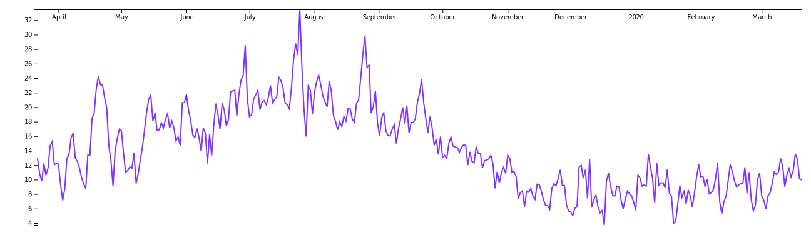
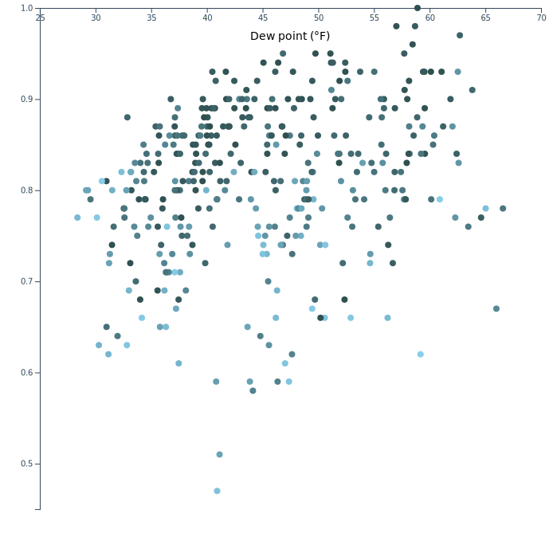

# d3-visualisations
📊 Data visualisations using the D3 library

### Annual Daily Temperature
Simple line plot of the maximum temperature in the last 365 days, for Manchester, UK.

### Dew Point vs Humidity
Scatter graph to see the correlation between dew point and humidity. Cloud cover is also indicated by the colour of each point.

